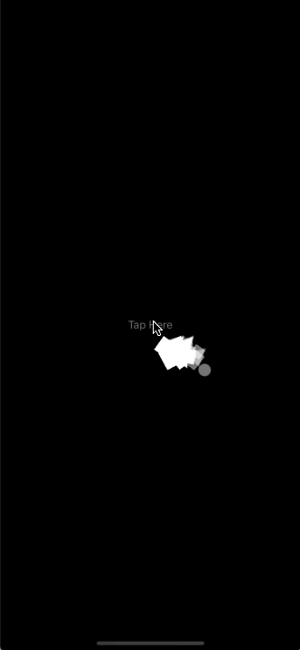

# SwiftFunnyAnimations

[](https://travis-ci.org/mmachado53/SwiftFunnyAnimations)
[](https://cocoapods.org/pods/SwiftFunnyAnimations)
[](https://cocoapods.org/pods/SwiftFunnyAnimations)
[](https://cocoapods.org/pods/SwiftFunnyAnimations)


## Example

To run the example project, clone the repo, and run `pod install` from the Example directory first.

## Requirements

## Installation

SwiftFunnyAnimations is available through [CocoaPods](https://cocoapods.org). To install
it, simply add the following line to your Podfile:

```ruby
pod 'SwiftFunnyAnimations'
```

## Author

mmachado53, mmachado53@gmail.com

## Usage
Just use FunnyAnimations Class.
### Initializing FunnyAnimations

```swift
CustomViewController.swift

import SwiftFunnyAnimations

override func viewDidLoad() {
        super.viewDidLoad()
        // param rootview should be the view where the particles will be added can be a window
        let funnyAnimationsInstance = FunnyAnimations(rootview: self.view)
    }
```

### Adding particle types
before starting an animation we need to add particle types. See examples:

#### Samples

 ```swift
 CustomViewController.swift
 
 import SwiftFunnyAnimations
 
 override func viewDidLoad() {
    super.viewDidLoad()
    // param rootview should be the view where the particles will be added can be a window
    let funnyAnimationsInstance = FunnyAnimations(rootview: self.view)

    /*
        Can add shapes (triangles,squares, circles)
    */    

    funnyAnimationsInstance.appendParticles(from: [.circle], size: 30, colors: [UIColor.red,UIColor.blue])
    print(funnyAnimationsInstance.totalParticlesTypes) // 2. "two types of particles have been generated (red circles and blue circles)"
    
    funnyAnimationsInstance.appendParticles(from: [.triangle], size: 30, colors: [UIColor.red])
    print(funnyAnimationsInstance.totalParticlesTypes) // 3. 1 types of particles have been generated and added. Now exist: red circles, blue circles and red triangles
    
    funnyAnimationsInstance.clearParticlesTypes()
    print(funnyAnimationsInstance.totalParticlesTypes) // 0. clearParticlesTypes remove all particles types
    
    funnyAnimationsInstance.appendParticles(from: [.circle,.square], size: 30, colors: [UIColor.red,UIColor.blue])
    print(funnyAnimationsInstance.totalParticlesTypes) // 4. red circles, blue cricles, red squares and blue squares

    funnyAnimationsInstance.clearParticlesTypes()
    /*
        Can add uiimage´s
    */
    funnyAnimationsInstance.appendParticles(from: [uiimageinstance1,uiimageinstance2])
    
    funnyAnimationsInstance.clearParticlesTypes()
    
    /*
        Can add tinted uiimage´s
    */
    funnyAnimationsInstance.appendParticles(from: [uiimageinstance1,uiimageinstance2], tintColors:[UIColor.red, UIColor.blue])
    
}
 ```

### Start the animation!
For now there are only 2 animations, both can go in 4 directions:

#### Rain
##### Rain to down:


```swift
import UIKit
import SwiftFunnyAnimations

@IBAction func tapButtonAction(_ sender: UIView){
    self.funnyAnimationsInstance.startWaveRain(total: 50, direction: .toDown, sizeVariation: 0.5, randomRotation: true)
}
```

##### Rain to top:


```swift
import UIKit
import SwiftFunnyAnimations

@IBAction func tapButtonAction(_ sender: UIView){
    self.funnyAnimationsInstance.startWaveRain(total: 50, direction: .toTop, sizeVariation: 0.5, randomRotation: true)
}
```

##### Rain to left:


```swift
import UIKit
import SwiftFunnyAnimations

@IBAction func tapButtonAction(_ sender: UIView){
    self.funnyAnimationsInstance.startWaveRain(total: 50, direction: .toLeft, sizeVariation: 0.5, randomRotation: true)
}
```

##### Rain to Right:


```swift
import UIKit
import SwiftFunnyAnimations

@IBAction func tapButtonAction(_ sender: UIView){
    self.funnyAnimationsInstance.startWaveRain(total: 50, direction: .toRight, sizeVariation: 0.5, randomRotation: true)
}
```

#### Wave
##### Wave to top


```swift
import UIKit
import SwiftFunnyAnimations

@IBAction func tapButtonAction(_ sender: UIView){
    self.funnyAnimationsInstance.startWave(from: sender, total: 20, direction: .toTop, sizeVariation: 0.5, randomRotation: true)

    /* could be from a point instead of a view */

    let point:CGPoint = sender.convert(CGPoint(x: sender.frame.width / 2, y: sender.frame.height / 2), to: self.view)
    self.funnyAnimationsInstance.startWave(from: point, total: 20, direction: .toTop, sizeVariation: 0.5, randomRotation: true)
}
```

##### Wave to down


```swift
import UIKit
import SwiftFunnyAnimations

@IBAction func tapButtonAction(_ sender: UIView){
    self.funnyAnimationsInstance.startWave(from: sender, total: 20, direction: .toDown, sizeVariation: 0.5, randomRotation: true)

    /* could be from a point instead of a view */

    let point:CGPoint = sender.convert(CGPoint(x: sender.frame.width / 2, y: sender.frame.height / 2), to: self.view)
    self.funnyAnimationsInstance.startWave(from: point, total: 20, direction: .toDown, sizeVariation: 0.5, randomRotation: true)
}
```

##### Wave to left


```swift
import UIKit
import SwiftFunnyAnimations

@IBAction func tapButtonAction(_ sender: UIView){
    self.funnyAnimationsInstance.startWave(from: sender, total: 20, direction: .toLeft, sizeVariation: 0.5, randomRotation: true)

    /* could be from a point instead of a view */

    let point:CGPoint = sender.convert(CGPoint(x: sender.frame.width / 2, y: sender.frame.height / 2), to: self.view)
    self.funnyAnimationsInstance.startWave(from: point, total: 20, direction: .toLeft, sizeVariation: 0.5, randomRotation: true)
}
```

##### Wave to right


```swift
import UIKit
import SwiftFunnyAnimations

@IBAction func tapButtonAction(_ sender: UIView){
    self.funnyAnimationsInstance.startWave(from: sender, total: 20, direction: .toRight, sizeVariation: 0.5, randomRotation: true)

    /* could be from a point instead of a view */

    let point:CGPoint = sender.convert(CGPoint(x: sender.frame.width / 2, y: sender.frame.height / 2), to: self.view)
    self.funnyAnimationsInstance.startWave(from: point, total: 20, direction: .toRight, sizeVariation: 0.5, randomRotation: true)
}
```

##### sizeVariation
0 = no variation, 0.5 the particles will appear from 50% to 150% of their original size
##### randomRotation
if is true the particles will appear with random rotation values


## License

SwiftFunnyAnimations is available under the MIT license. See the LICENSE file for more info.
